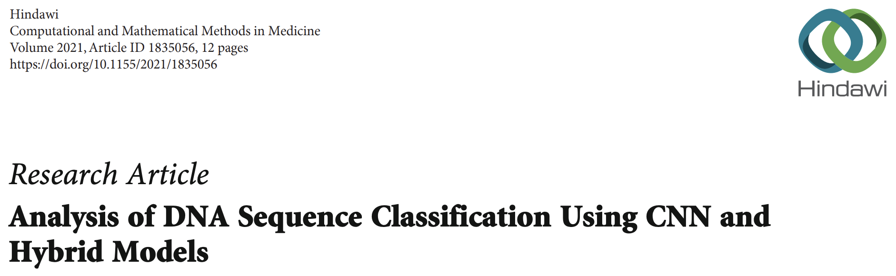
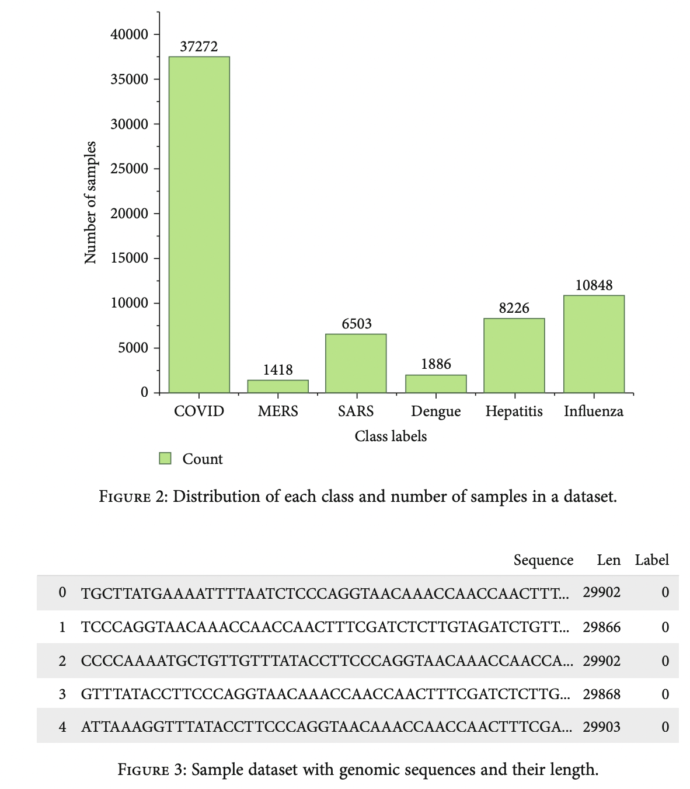
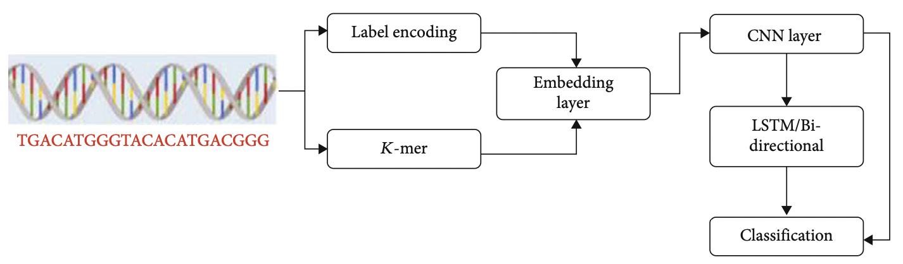
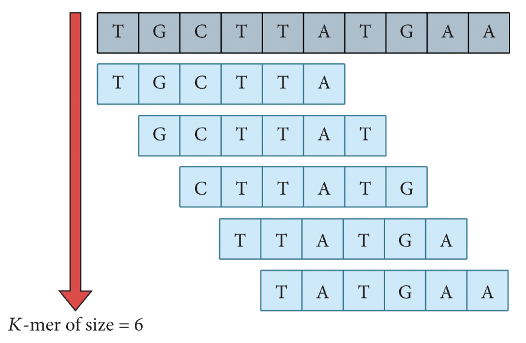
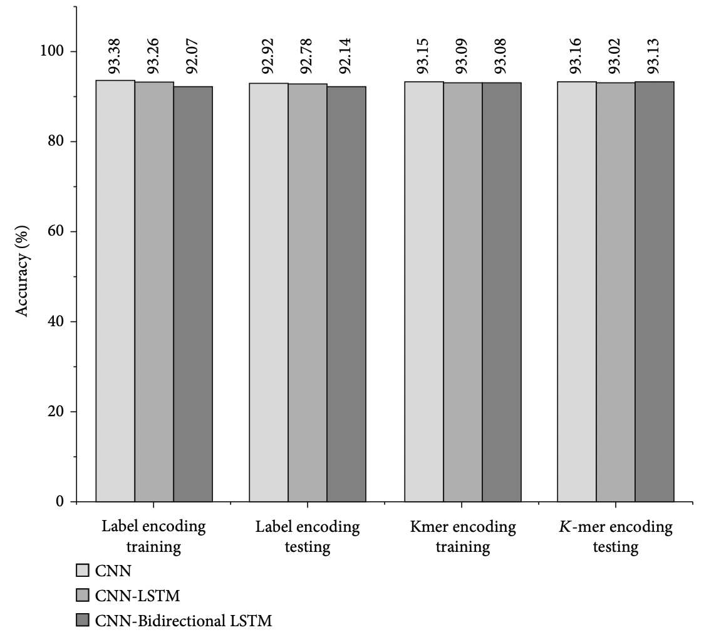

```{r setup, include=FALSE}
knitr::opts_chunk$set(echo = FALSE, warning = FALSE, message = FALSE)
if (!require("pacman")) install.packages("pacman")
pacman::p_load(knitr, ggplot2, dplyr, tidyr, plotly, gridExtra)
```

---

## BI에서의 딥러닝 활용

<br>


#### - Paper title



<br>

- 머신러닝, 딥러닝 등 여러 분석 기법을 배우고 있지만 실무적으로 어떻게 쓰일 수 있는지 예시를 보여주기 위함.
- 실무적으로 다룰 데이터가 어떤 특성을 가지는 것인지 즉, 도메인의 지식이 중요하다는 것을 알 수 있음.

<br><br>


#### - Sample Status



<br><br>

#### - Classification workflow



<br><br>

#### - Process

1. Data Collection
  - 모든 샘플은 NCBI에서 확보
  - class imbalance하게 때문에 SMOTE 적용
2. Data pre-processing
  - DNA sequence는 문자열 데이터이기 때문에 수치형 데이터로 변환하는 encoding 작업을 진행
    1. Label encoding
    2. K-mer encoding(k-means 아님)
    
    

3. Classification model
  - CNN
  - CNN + LSTM
  - CNN + Bidirectional LSTM

<br><br>

#### - Accuracy of classification models



<br><br>

#### - Conclusion

- 이 논문의 목적은 사실상 DNA sequence를 이용하여 species를 잘 classification 할 수 있는지, 그리고 정확도는 좋은지 확인하는 목적
- 그러나 BI 실무 및 딥러닝 입문자의 입장에서는 딥러닝 기술을 이용하여 meta genome(여러 genome이 모여있는 형태)에 대해 각 species별 분류가 가능하고, 더 나아가 아직 밝혀지지 않은 sequence 정보를 확보 후 신약 개발에 응용한다는 등 여러 가능성이 보임.(물론 이미 많은 개발이 이루어져있겠지..)

<br><br>


**위 내용들은 모두 아래의 논문을 참고하였음**

[Analysis of DNA Sequence Classification Using CNN and Hybrid Models](https://www.hindawi.com/journals/cmmm/2021/1835056/)
