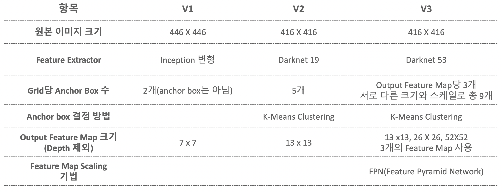
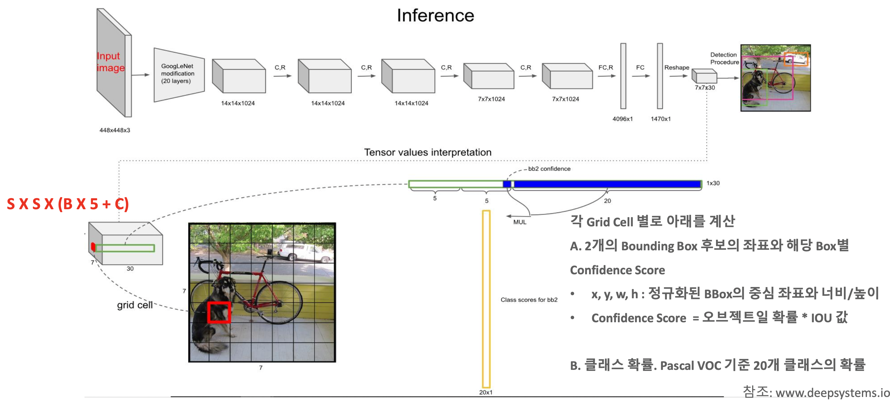
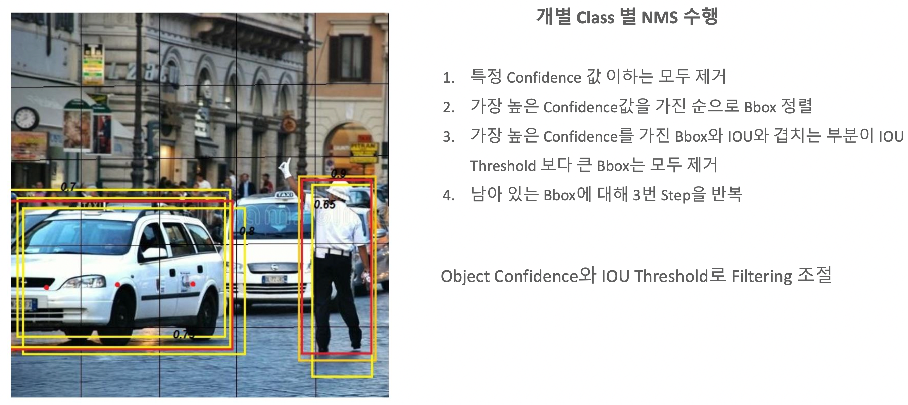
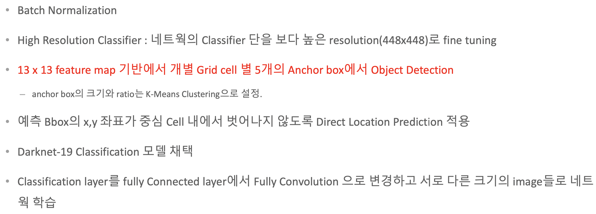
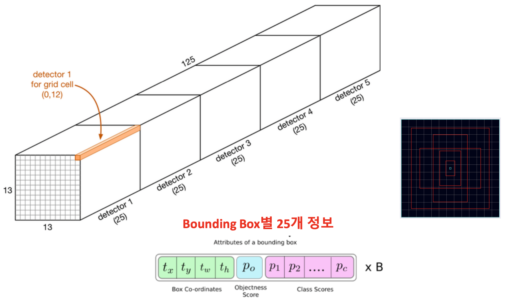
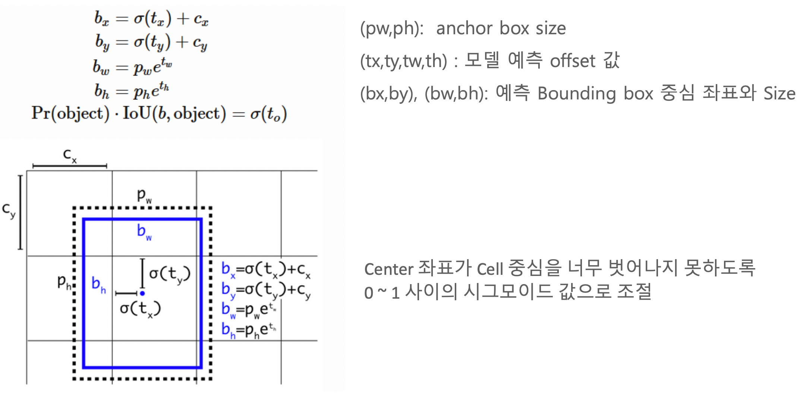
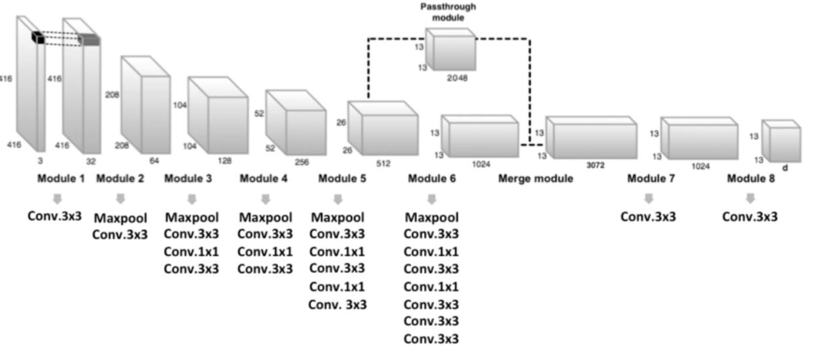
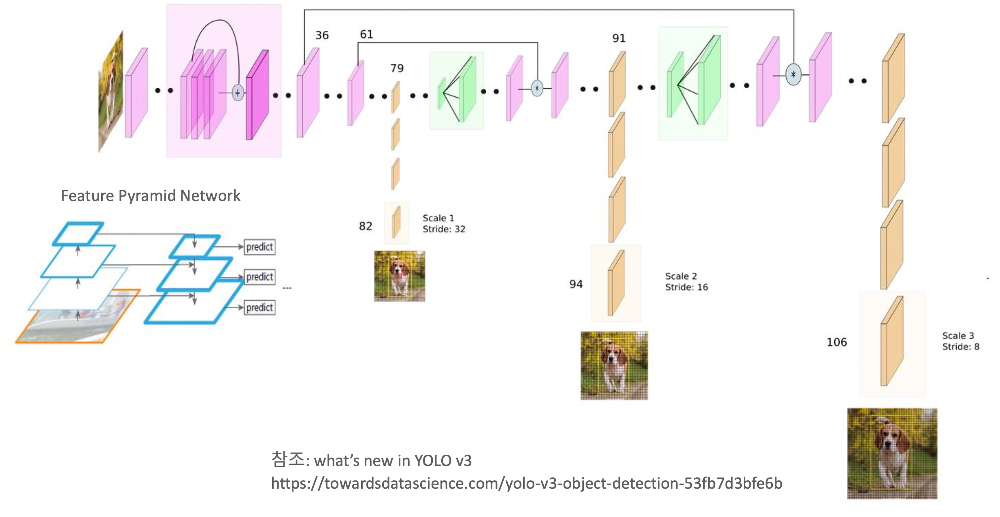
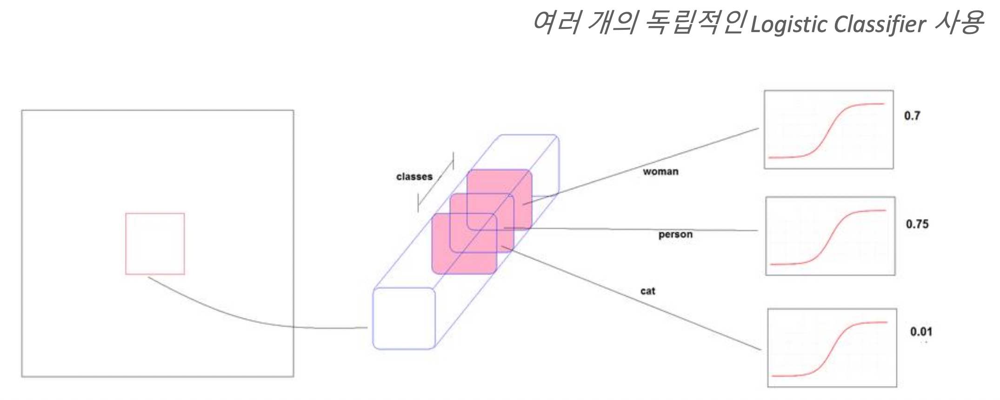
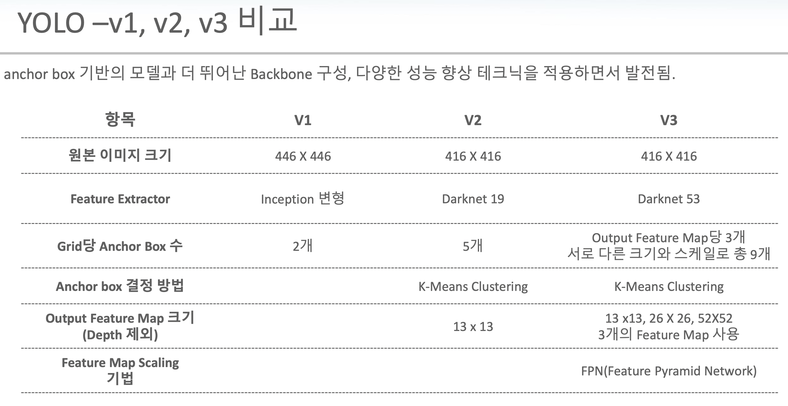

```{r setup, include=FALSE}
knitr::opts_chunk$set(echo = FALSE, warning = FALSE, message = FALSE)
if (!require("pacman")) install.packages("pacman")
pacman::p_load(knitr, ggplot2, dplyr, tidyr, plotly, gridExtra)
```

---



<br><br>

## 1. YOLO - V1

<br>

- input image를 S x S로 나눈 grid의 각각의 cell 별로 하나의 object에 대한 detection 수행
- 각 cell이 2개의 Bounding box를 기반으로 하나의 object에 대한 bounding box 예측



<br>

- input image는 반복되는 C.R > dense layer(classification, regression) > output feature map( S x S grid )
- S x S grid가 갖는 channel은 다음의 특징을 가질 것으로 추정
  - 사용하는 데이터 셋마다 다름(예측하는 object 종류에 따라)
  1. 2개의 bounding box에 대한 좌표
  2. Confidence Score = probability of object( not class )
  3. 예측하고자 하는 각 class 별 확률

> PASCAL VOC 데이터 셋인 경우 예측하고자 하는 class가 20개이기 때문에, channel은 5*2+20

<br>

#### Loss function

<br>

1. BBox central X,Y loss

- 예측 좌표 x,y값과 Ground Truth x,y 오차 제곱 기반
- 모든 cell * 2개의 BBox 중 대표되는 BBox만 계산

2. BBox width, height loss

- x,y와 동일하지만 오차 제곱을 기반으로 계산
- 크기에 따라 error가 커지는 것을 제한하기 위해 제곱근 사용

3. Object Confidence loss

- Ground Truth 와의 Object Confidence Score의 IoU 기반 예측 오차
- 각 cell 당 2개의 BBox모두 확인

4. Classification loss

- 대표되는 BBox에 대해 object class 별 확률 오차의 제곱

<br>



<br>

#### One stage detector의 경우 대부분 NMS로 마무리 하는 경향이 있음.
#### NMS 종류

1. Greedy NMS : [Object Detection과 Segmentation](https://innerpyg.github.io/computervision/2022/04/30/Chapter1.html)에서 배웠던 내용처럼, 높은 Confidence score를 가진 BBox을 뽑고, Ground Truth와의 IoU가 낮은 BBox를 제거하는 가장 일반적인 방법.
2. Soft NMS : YOLO - V1에 적용된 NMS 방법으로 Confidence score가 가장 높은 BBox를 시작으로 겹치는 BBox 간의 IoU가 특정 threshold 이상 값을 나타낼 때, 해당 BBox를 제거하는 방법.
3. DIoU(Distance IoU) NMS : 두 BBox의 중심점의 거리를 고려
4. GIoU, CIoU

<br>

**YOLO - V1은 속도는 빨라졌으나, 성능 특히 작은 object detection 성능이 좋지 않다.**

<br><br>

## 2. YOLO - V2

<br>



**지금까지는 Feature Extract > Classification layer(dense)의 형태였는데, YOLO-V2에서는 Classification시 dense가 아닌 Fully Conv layer로 변경**
**학습 시 Feature Extract 부분은 freezing하여 weight를 업데이트 하지 않도록 하고, Fully Conv만 weight를 업데이트**
**input image의 크기는 32배수가 아니면 feature map size 문제로 진행할 수 없다고 이해.**

**여기서 한가지 의문은... 서로 다른 크기의 image들을 학습하는 상황에서 만약 dense를 쓴다면 서로 다른 크기의 이미지들로 부터 생성되는 dense의 사이즈가 달라지기 때문에 dense를 할 수 없다고 하는 것 같은데... <span style="color:red"> flatten layer로 dense를 만들 때 SPP같은 걸 쓰면 서로 다른 크기의 이미지라도 같은 크기의 1D dense layer를 만들 수 있는 거 아닌가?</span>**

<br>

#### Output Feature Map

<br>



<br>

#### Direct location prediction

<br>



<br>

- RCNN에서도 bounding box regression을 진행했었으나, 그대로 진행하게 되면 현재 각 cell 단위로 진행하는 시점에서는 기준이 되는 cell의 범위를 벗어난 곳에 bounding box가 형성될 수도 있음. 특히 학습이 제대로 되어있지 않은 초기에는 문제가 심각할 것으로 보임.
- 그렇기 때문에 각 cell을 기준 좌상단 점으로 부터 cell을 벗어나지 않는 곳에 중심점을 잡고 predicted bounding box가 형성되기 하기 위해서는 sigmoid function을 적용하여 width와 height가 0 ~ 1범위 내에 존재하게 하는 것이 중요.

<br>

#### Passthrough module 적용

<br>


- 작은 object를 detect하기 위해 다소 큰 feature map을 reshape함으로써 성능을 보정
- 앞서 [SDD](https://innerpyg.github.io/computervision/2022/05/19/Chapter3.html)에서 multi-scale feature map을 이용하여 크고 작은 object를 detection하려는 것과 같이, 특정 시점의 feature map의 특성을 단순히 reshape함으로써 좀 더 작은 object를 detect하기 위함.

<br><br>

## 3. YOLO - V3

<br>

- Feature Pyramid Network 유사한 기법을 적용하여 3개의 Feature Map Output에서 각각 3개의 서로 다 른 크기와 scale을 가진 anchor box 로 Detection
- Backbone성능향상-Darknet-53
- Multi Labels 예측: Softmax가 아닌 Sigmoid 기반의 logistic classifier로 개별 Object의 Multi labels 예측

<br>

#### YOLO V3 Network 구조



<br>

- 79 layer의 feature map을 이용하여 보다 큰 Object들을 detection
- 79 layer의 feature를 resizing(2배)하고 앞선 61번 layer의 feature map과 합친 후 91 layer에서 detection
- 91 layer를 feature를 resizing하여 36번과 합친 후 detection

> 서로 다른 크기의 object들을 잘 detect하기 위함

#### Multi labels prediction

<br>



<br>

prediction 방식이 특정 class를 가리키는 방식이 아니라 예측하고자 하는 모든 class에 대해서 확률값으로 계산

<br>

## YOLO Summary

<br>


