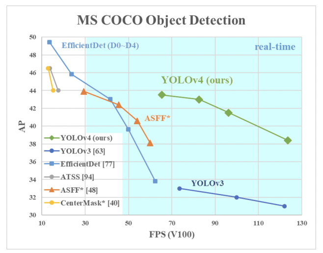

```{r setup, include=FALSE}
knitr::opts_chunk$set(echo = FALSE, warning = FALSE, message = FALSE)
if (!require("pacman")) install.packages("pacman")
pacman::p_load(knitr, ggplot2, dplyr, tidyr, plotly, gridExtra)
```

## YOLO v4 : Optimal Speed and Accuracy of Objefct Detection.

<br>

#### Reference

<br>

[YOLO v4 Paper](https://arxiv.org/pdf/2004.10934v1.pdf)

<br>

#### Abstract

- CNN 정확도 개선을 위한 수많은 feature(function)들이 존재
- 어떤 feature들은 특정 model or problem에만 국한되어 동작하거나 소규모 데이터셋에 대해서만 동작하는 것들이 있음
- 반면에 대부분의 model 등에 적용 가능한 universal 한 feature들이 존재함
  - Weighted-Residual-Connections(WRC)
  - Cross-Stage-Partial-connections(CSP)
  - Cross mini-Batch Normalization (CmBN)
  - Self-adversarial-training(SAT)
  - Mish-activation
- 이 논문에서는 아래의 내용에 따라 분석을 진행함.
  - WRC, CSP, CmBN, SAT, Mish-activation, Mosaic data augmentation, DropBlock regularization, CIoU를 조합하여 SOTA 달성.
  - MS COCO data 기준 43.5% AP(65.6% AP<sub>50</sub>)
  - Tesla V100 기준 ~ 65FPS

<br>

**YOLO v4**
 - CSPDarknet53
 - SPP + PAN
 - YOLO v3
 - Many BoF + Bos feautres

---

<br>

#### Intro

- 대부분의 CNN 기반 object detection에는 정확도와 속도 간 trade-off가 존재
  - 주차 가능 공간 탐색 : 느리지만 정확한 Model
  - 차량 추돌 경고 : 빠르지만 부정확한 Model
- 본 논문의 목적
  - 누구나 실시간/고품질의 결과를 얻을 수 있도록
  - BFLOP 즉, 연산을 줄이는 게 아니라 생산하는 단계에서 빠른 속도로 동작하는 object detector 고안하고 병렬 최적화
  


  
- 본 논문의 결과 기여
  - 보다 강력한 Object detector 개발
  - 최신 Bag-of-freebies, Bag-of-Specials 기법 효과 검증
  - 단일 GPU에 효율적으로 적합하기 위한 최신 기법들을 수정
    - CBN
    - PAN
    - SAM
    - etc..
    
<br>

#### Related work

- Object Detection model
  1. Backbone : ImageNet을 이용한 pre-trained
      - GPU 기반 : VGG, ResNet, ResNeXt, DenseNet, etc
      - CPU 기반 : SqueezeMet. MobileNet, ShuffleNet, etc
  2. Head : class와 BBox prediction에 적용
      - one-stage detector
        - anchor-based : YOLO, SSD, RetinaNet, etc
        - anchor-free : CenterNet, CornetNet, FCOS, etc
      - two-stage detector
        - anchor-based : R-CNN series, etc
        - anchor-free : RedPoints, etc
  3. Neck : backbone과 head 사이에 크고 작은 object detection가 가능하도록  여러 feature map의 특성을 모으는 역할
      - Feature Pyramid Network(FPN), Path Aggregation Network(PAN), BiFPN, NAS-FPN, etc
  4. Others : 새롭게 연구 된 부분
      - 새로운 backbone : DetNet, DetNAS, etc
      - 새로운 모델 구축 : SpineNet, HitDetector, etc
    
<br>

**일반적인 object detection 구조**


<br>

- Bag of Freebies(BoF)

  1. data augmentation
    - input의 가변성을 증가시켜 model이 다른 환경에서 얻은 이미지(resolution 등 quality 차이가 있는)에 대해서도 높은 강건함을 유지하는 것이 목적
      - 광학적, 기하학적, pixel-wise
      - object occlusion 문제에 중점을 연구
      - 여러 이미지를 함께 사용하는 방법
      - style transfer GAN 적용하여 texture bias를 효과적으로 줄임.
  2. regularization
    - data augmentation과 유사한 개념을 feature map에 적용하는 연구
  3. imbalance sampling
      - class imbalance
      - 서로 다른 category 간 연관성을 표현하기 어려운 부분에 대한 연구
  4. objective function(BBox regression) - [IoU description page. to be update]()
      - IoU loss
      - GIoU loss
      - DIoU, CIoU loss

<br>

- Bag of Specials(BoS)

  1. plugin modules
      - receptive field enhancement module
        - SPP
        - ASPP
        - REB
      - attention modules
        - Squeeze-and-Excitation(SE)
        - Spatial Attention Module(SAM)
      - feature integration
        - FPN 등
      - activation function : gradient vanish 문제 해결하기 위해
        - ReLU
        - LReLU, PReLU : ReLU의 출력이 0보다 작을 경우 gradient가 0이 되는 문제를 해결
        - ReLU6, hard-Swish : quantization networks를 고려
        - SELU : neural network를 self-normalizing하기 위한 목적
        - Swish, Mish : continuously differentiable activation function
        
<br>
        
  2. post-processing : 일반적으로 NMS(Non-Maximum Suppression)
      - NMS
      - greedy NMS
      - soft NMS, DIoU
      
        ###### > anchor-free 기법에서는 post-processing이 필요하지 않음.


<br>

#### Methodology

<br>

1. Selection of architecture
    - detector 선택 시 고려 사항
      - 더 큰 크기의 input resolution
      - 더많은 layer 수 > 더 큰 receptive field
      - 더 많은 parameter 수 : 서로 다른 크기의 objects들을 검출하기 위해
    - CSPDarknet53에 SPP block 추가
      - receptive field 향상
      - context features 분리
      - network 속도 저하 없음
    - CPSDarknet53에 parameter aggregation 기법으로 PAN 이용


  
    

<br>

> 최종적으로 선택된 기법들 <br>
  backbone : CSPDarknet53 <br>
  neck <br>
    - additional blocks : SPP <br>
    - path-aggregation blocks : PANet <br>
  head : YOLO v3(anchor-based)

<br>

2. Selection of BoF and BoS
  - BoF 후보 features
    - BBox regression : MSE, IoU, GIoU, DIoU, CIoU
    - data augmentation : CutOut, MixUp, CutMix
    - regulation method : ~~DropOut, DropPath, Spatial DropOut~~, DropBlock
    
      ###### > DropBlock을 게시한 사람들이 다른 정규화 방법과 비교했을 때 우수한 성능을 보임을 입증
  
  - BoS 후보 features
    - activations : ReLU, leaky-ReLU, ~~parametric ReLU, ReLU6, SELU~~, Swish, Mish
    - normalization of the network activations
      - Batch Normalization
      - ~~Cross GPU batch Normalization(CGBN or SyncBN)~~ : 본 연구는 하나의 GPU를 이용하는 것이 중점이기 때문에 제외
      - Filter Response Normalization
      - Cross-iteration Batch Normalization
    - skip-connections
      - Residual connections
      - Weighted residual connections
      - Multi-input weighted residual connections
      - Cross stage partial connections(CSP)

<br>

3. Additional improvements
  - 새롭게 도입한 BoF data augmentation
    - Mosaic
      - 4개의 train image를 1개로 mix
      - batch normalization은 각 layer 상에서 서로 다른 4개의 이미지들에 대한 activation statistic 계산 가능
      
        ###### > 큰 크기의 mini-batch에 대한 필요성을 줄일 수 있음.
        
    - SAT(Self-Adversarial Training)
      - 2단계의 forward & backward 단계로 동작
      - 1단계 : network의 weight가 아닌 원본 이미지를 변경
      
        ###### > 자체적으로 adversarial attack을 수행, 이미지에 원하는 object가 없다는 속임수를 만들도록 원본 이미지를 변경
      - 2단계 : 변경된 이미지에 대해 정상적인 방식의 object detect하도록 training
  - BoS
    - CmBN
      - CBN의 변경된 버전, 단일 batch 내에서 mini-batches 간 statistic 수집
      - BN은 batch size가 작을 경우 examples에 대해 정확한 statistic estimation이 어려움
      
      ###### > CBN은 이전 iteration들의 statistic을 함께 활용
      
      <br><br>
    - modified SAM(Spatial Attention Module), modified PAN(Path Aggregation Network)
      - SAM을 spatial-wise > point-wise로 변경
      - PAN의 shortcut connection > concatenation으로
      
      
      
<br>

---

**4. YOLO v4 architecture**

 - CSPDarknet53
 - SPP + PAN
 - YOLO v3
 - Many BoF + Bos feautres
 
 - BoF
  - for backbone
    - data augmentation : CutMix, Mosaic
    - imbalance sampling : Class labeling smoothing
    - regularization : DropBlock
  - for detector
    - object function : CIoU loss
    - normalization of network activation : CmBN
    - regularization : DropBlock
    - data augmentation : Mosic, Self-Adversarial Training(SAT)
    - hyper-parameters optimization : Genetic algorithms
    - learning rate scheduler : Cosine annealing scheduler
    - others
      - Eliminate grid sensitivity
      - Using multiple anchors for a single ground truth
      - Random training Shapes.
  
  - BoS
    - for backbone
      - activation function : Mish
      - skep-connection : CSP, MiWRC
    - for detector
      - activation function : Mish
      - receptive field enhancement : SPP
      - attention : SAM
      - feature integration : PAN
      - post-processing : DIoU NMS

<br><br>

**용어 정리**

- ASFF : Adaptively Spatial Feature Fusion
- ASPP : Atrous Spatial Pyramid Pooling
- BiFPN : Bidirectional Feature Pyramid Network
- CBN : Cross-iteration Batch Normalization
- CmBN : Cross mini-Batch Normalization
- CSP : Cross-Stage-Partial-connections
- FCOS : Fully Convolutional One-Stage pbject detector
- MiWRC : Multi-input-Weighted-Residual-Connections
- NAS-FPN : Neural Architecture Search Feature Pyramid Network
- PAN : Path Aggregation Network
- RFB : Receptive Field Block
- SAM : Spatial Attention Module
- SAT : Self-Adversarial-Training
- SE : Squeeze-and-Exitation
- SFAM : Scale-wise-Feature-Aggregation Module
- SPP : Spatial Pyramid Pooling
